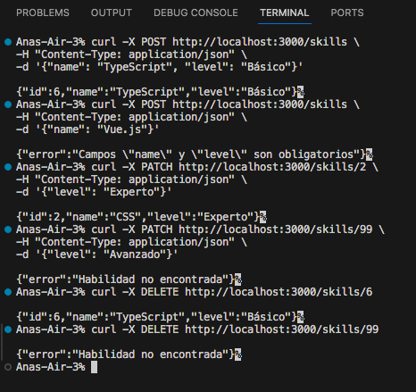

# 🚀 API REST — HABILIDADES DEL CV

**Proyecto realizado por:** Ana Sofía Eggenberger  
**Curso:** Desarrollo Web  
**Entregable 10 — API REST con Node.js + Express**

---
## 📘 Descripción general

Esta API permite gestionar las habilidades (skills) del CV personal.
Está desarrollada con Node.js, Express y CORS, usando una base de datos temporal en memoria.

Permite realizar todas las operaciones CRUD:

| Método | Ruta | Descripción |
|--------|------|-------------|
| **GET** | `/skills` | Obtener todas las habilidades |
| **GET** | `/skills/:id` | Obtener una habilidad por su ID |
| **POST** | `/skills` | Crear una nueva habilidad |
| **PATCH** | `/skills/:id` | Actualizar parcialmente una habilidad |
| **DELETE** | `/skills/:id` | Eliminar una habilidad |
| — | Rutas inválidas | Muestran error 404 |

---
## ⚙️ Instalación y ejecución

1. Abre la terminal y navega hasta el proyecto:
cd ~/Documents/GitHub/Web-Development/mi-api

2. Instala las dependencias:
npm install

3. Inicia el servidor en modo desarrollo:
npm run dev

4. Verifica en el navegador:
http://localhost:3000

Deberías ver el mensaje:
🚀 API de Habilidades funcionando correctamente

## 💡 Datos iniciales

La API contiene una base de datos temporal con estas habilidades:

[
{ "id": 1, "name": "HTML", "level": "Avanzado" },
{ "id": 2, "name": "CSS", "level": "Avanzado" },
{ "id": 3, "name": "JavaScript", "level": "Intermedio" },
{ "id": 4, "name": "Angular", "level": "Intermedio" },
{ "id": 5, "name": "Python", "level": "Avanzado" }
]

## 🧩 Ejemplos de uso
1️⃣ GET /skills

URL: http://localhost:3000/skills

Respuesta:
[
{ "id": 1, "name": "HTML", "level": "Avanzado" },
{ "id": 2, "name": "CSS", "level": "Avanzado" },
{ "id": 3, "name": "JavaScript", "level": "Intermedio" },
{ "id": 4, "name": "Angular", "level": "Intermedio" },
{ "id": 5, "name": "Python", "level": "Avanzado" }
]

2️⃣ GET /skills/:id

Ejemplo: http://localhost:3000/skills/3

Respuesta:
{ "id": 3, "name": "JavaScript", "level": "Intermedio" }

Error (ID inexistente):
{ "error": "Habilidad no encontrada" }

3️⃣ POST /skills

Comando desde terminal:
curl -X POST http://localhost:3000/skills
 -H "Content-Type: application/json" -d '{"name": "TypeScript", "level": "Básico"}'

Respuesta:
{ "id": 6, "name": "TypeScript", "level": "Básico" }

Error (falta un campo):
{ "error": "Campos "name" y "level" son obligatorios" }

4️⃣ PATCH /skills/:id

Comando:
curl -X PATCH http://localhost:3000/skills/2
 -H "Content-Type: application/json" -d '{"level": "Experto"}'

Respuesta:
{ "id": 2, "name": "CSS", "level": "Experto" }

Error (ID inexistente):
{ "error": "Habilidad no encontrada" }

5️⃣ DELETE /skills/:id

Comando:
curl -X DELETE http://localhost:3000/skills/6

Respuesta:
{ "id": 6, "name": "TypeScript", "level": "Básico" }

Error (ID inexistente):
{ "error": "Habilidad no encontrada" }

6️⃣ Rutas inexistentes

URL: http://localhost:3000/aaaa

Respuesta:
{ "error": "Ruta no encontrada" }

## 📸 Capturas de evidencia

Evidencia del funcionamiento de la API:

## 🧠 Notas finales

Esta API no guarda datos permanentemente; al reiniciar el servidor, los datos vuelven a su estado inicial.

Puede conectarse fácilmente con el componente skills de Angular para mostrar habilidades dinámicas.

Proyecto probado 100 % desde navegador y terminal (curl), ya que Postman no es compatible con esta versión de macOS.